# motion-design

Motion designs codés en HTML/CSS/GSAP, rendus image par image en MP4 (Playwright + ffmpeg).

## Pignon — 15 s, 9:16

**Vidéo : [`renders/pignon-15s-9x16.mp4`](renders/pignon-15s-9x16.mp4)** — 1080 × 1920, 60 i/s, H.264 (BT.709), sans piste son.
Couverture : [`renders/pignon-couverture.png`](renders/pignon-couverture.png).


| Temps | Scène | Contenu |
|---|---|---|
| 0 – 2,1 s | Accroche | « Chaque adresse a quelque chose à cacher. » Un clic sur la carte fait apparaître le point sur le local. |
| 2,1 – 4,6 s | 01 · L’adresse | « Qui a tenu ici ? » Survie du métier : 63 % (fourchette 51 à 74 %) et historique du local : huit ouvertures depuis 1992. |
| 4,6 – 7,1 s | 02 · Autour du point | « Jusqu’où à 10 minutes ? » Isochrone à pied calculée sur le réseau de rues, concurrents, 10 790 hab. et 3 800 €/m². |
| 7,1 – 9,4 s | 03 · Le comparateur | « Vos adresses, côte à côte. » Fourchettes qui se chevauchent, donc écart non établi. |
| 9,4 – 11,7 s | 04 · L’assistant | « Pourquoi, pas juste combien. » Une question et la réponse d’Insights IA. |
| 11,7 – 15 s | Appel à l’action | Le point de la carte devient le point du i du logo. « Le bail dure trois ans. Le clic prend trois secondes. », bouton « Explorer la carte → », « Compte gratuit, sans carte bancaire. », pignon.webapp.lv |

### Charte reprise

Source : webarchive de la page Carte de pignon.webapp.lv, plus des captures du site.

- **Couleurs** : les tokens de `pignon-tokens.css`. Terracotta 600 `#a55535` (actions, logo), pétrole 600 `#00494a` (données, point du i), neutres chauds `#f9f6f2` / `#fefbf9`, couleurs du comparateur `#00958f` / `#b54628`.
- **Typographies** : Newsreader (titres), IBM Plex Sans (interface), IBM Plex Mono (chiffres, surtitres), Bricolage Grotesque 700 (logo). Toutes sous licence OFL et incluses dans `pignon/fonts/`.
- **Logo** : reconstruit comme `.pgn-logo` du site (P, i dessiné, gnon).
- **Mouvement** : les courbes `--pgn-easing-standard` et `--pgn-easing-ressort`.
- **Carte** : l’algorithme du fond « rue » du site (`pignon-rue-bg.js`), étiré en portrait et rendu déterministe.
- **Textes** : repris du site (accroche, rubriques, CTA, réponse de l’assistant).

### Données

Les chiffres viennent de l’exemple publié sur le site (Place du Vieux-Marché, Rouen). Trois éléments sont illustratifs : la position des huit ouvertures sur la frise (cohérente avec les textes du site), les valeurs du « Local B » dans le comparateur, et la carte, qui est procédurale et ne représente pas Rouen.

## Pignon · ombres portées — 15 s, 9:16

**Vidéo : [`renders/pignon-ombres-15s-9x16.mp4`](renders/pignon-ombres-15s-9x16.mp4)** — 1080 × 1920, 60 i/s, sans son.
Couverture : [`renders/pignon-ombres-couverture.png`](renders/pignon-ombres-couverture.png).


| Temps | Scène | Contenu |
|---|---|---|
| 0 – 2,1 s | Accroche | « Votre terrasse, au soleil ou à l’ombre ? » La terrasse se dessine devant le local. |
| 2,1 – 6,4 s | 01 · L’heure | Le panneau « Ombres portées » de la carte. Le curseur Heure avance par pas d’une heure, de 8 h à 19 h le 21 juin ; les ombres tournent et la pastille passe de « À l’ombre » à « Au soleil ». |
| 6,4 – 9,6 s | 02 · La saison | « Et le 21 décembre à 15 h ? » Le curseur Saison glisse du 21 juin au 21 décembre ; les ombres s’allongent. |
| 9,6 – 11,7 s | 03 · Toute l’année | Bilan : soleil sur la terrasse de 8 h à 19 h, aux deux équinoxes et aux deux solstices. |
| 11,7 – 15 s | Appel à l’action | Le point de la terrasse devient le point du i. « Le bail dure trois ans. Le soleil, lui, tourne. », « Explorer la carte → » |

Les ombres ne sont pas animées à la main : chaque image calcule la position du soleil à Rouen pour la date et l’heure affichées (`pignon-ombres/soleil.js`, formules NOAA, heure d’été 2026), puis projette chaque bâtiment au sol selon sa hauteur. L’état de la pastille et le bilan viennent du même calcul. Les bâtiments, leurs hauteurs (9 à 24 m) et la terrasse sont fictifs : la terrasse est choisie automatiquement pour que soleil et ombre s’y relaient. Le panneau reprend `.pgn-panneau-ombres` (curseur Saison de 0 à 364, curseur Heure de 8 h à 19 h, repères et icônes du site). La phrase « Le soleil, lui, tourne. » est une proposition, elle n’est pas reprise du site.

## Pignon · Insights IA — 15 s, 9:16

**Vidéo : [`renders/pignon-ia-15s-9x16.mp4`](renders/pignon-ia-15s-9x16.mp4)** — 1080 × 1920, 60 i/s, sans son.
Couverture : [`renders/pignon-ia-couverture.png`](renders/pignon-ia-couverture.png).

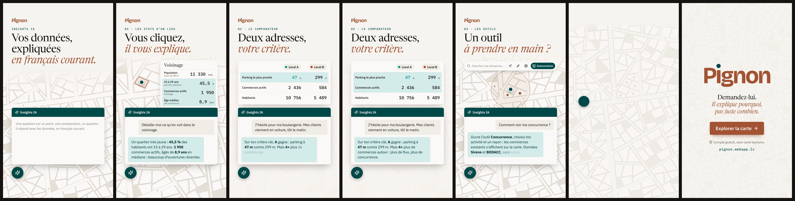

| Temps | Scène | Contenu |
|---|---|---|
| 0 – 2 s | Accroche | « Vos données, expliquées en français courant. » Le bouton de l’assistant s’ouvre en panneau Insights IA, comme sur la carte. |
| 2 – 5,6 s | 01 · Les stats d’un lieu | Un clic sur la carte ouvre le panneau Voisinage ; l’IA l’explique et chaque ligne citée s’allume. |
| 5,6 – 9,2 s | 02 · Le comparateur | Projet de boulangerie, clients en voiture : l’IA tranche sur ce critère (parking à 47 m contre 299 m) et signale la concurrence. |
| 9,2 – 12,1 s | 03 · Les outils | « Comment voir ma concurrence ? » L’IA explique l’outil Concurrence pendant que la carte le montre : bouton, rayon, commerces. |
| 12,1 – 15 s | Appel à l’action | Le bouton de l’assistant devient le point du i. « Demandez-lui. Il explique pourquoi, pas juste combien. » (texte du site) |

Les échanges s’inspirent de trois sessions réelles, reformulées et raccourcies. Les chiffres viennent de ces sessions ; aucune adresse n’est citée (les deux emplacements comparés deviennent « Local A » et « Local B »). Le widget reprend `pignon-chat.css` : bouton rond pétrole, en-tête pétrole, bulles pétrole-100 pour l’assistant et neutre-100 pour l’utilisateur. Les commerces qui apparaissent dans le rayon sont illustratifs.

## Pignon · tuto « De la carte à la décision » — 20 s, 9:16

**Vidéo : [`renders/pignon-tuto-20s-9x16.mp4`](renders/pignon-tuto-20s-9x16.mp4)** — 1080 × 1920, 60 i/s, sans son.
Couverture : [`renders/pignon-tuto-couverture.png`](renders/pignon-tuto-couverture.png).

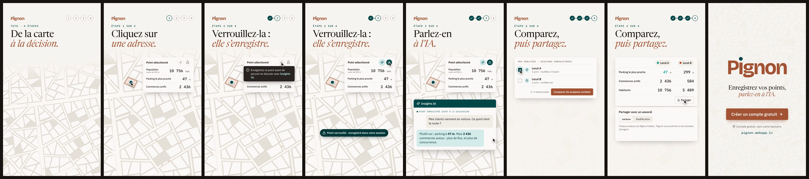

| Temps | Étape | Contenu |
|---|---|---|
| 0 – 2 s | Accroche | « De la carte à la décision. » (texte du site) et la progression en 4 étapes. |
| 2 – 4,9 s | 1 · Cliquez sur une adresse | Le curseur clique un local : le point apparaît, le panneau s’ouvre. |
| 4,9 – 8,9 s | 2 · Verrouillez-la : elle s’enregistre | Au survol du bouton IA, l’info-bulle de l’app : « Enregistrez ce point avant de pouvoir en discuter avec Insights IA. » Clic sur le cadenas : point verrouillé et enregistré, le bouton IA s’active. |
| 8,9 – 12,8 s | 3 · Parlez-en à l’IA | Le point enregistré est joint à la discussion ; question et réponse chiffrée. |
| 12,8 – 17,3 s | 4 · Comparez, puis partagez | Mes analyses : deux sessions cochées, « Comparer les analyses cochées », puis partage en lecture ou en modification. |
| 17,3 – 20 s | Appel à l’action | La dernière étape validée devient le point du i. « Enregistrez vos points, parlez-en à l’IA. », « Créer un compte gratuit → » |

Parcours et libellés repris de l’app (cadenas du panneau, message d’Insights IA sur l’enregistrement, Mes analyses, « Comparer les analyses cochées ») et du site (« Invitez vos associés à lire ou à modifier », « Pignon vous prévient quand les données ont changé »). La forme exacte du partage (sélecteur Lecture / Modification, « Invitation envoyée ») est une mise en scène. Aucune adresse n’est citée.

## Pignon · vue d’ensemble v2 — 29 s, 9:16

**Vidéo : [`renders/pignon-v2-29s-9x16.mp4`](renders/pignon-v2-29s-9x16.mp4)** · couverture : [`renders/pignon-v2-couverture.png`](renders/pignon-v2-couverture.png) — la version à jour de l’app (barre Carte, Mes analyses, Simulations, Rapports, Partages).

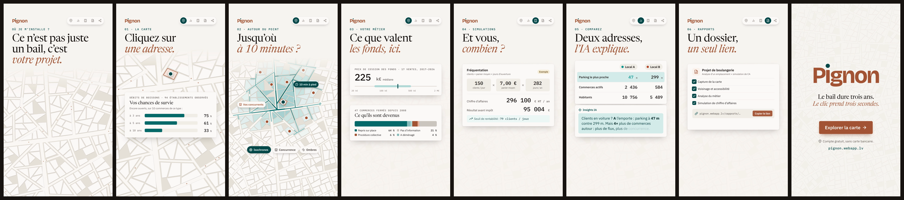

| Temps | Scène | Contenu |
|---|---|---|
| 0 – 2,4 s | Accroche | « Ce n’est pas juste un bail, c’est votre projet. » (site) |
| 2,4 – 6,3 s | 01 · La carte | Clic sur une adresse, chances de survie du métier : 75 % à 3 ans, 61 % à 5 ans, 33 % à 10 ans |
| 6,3 – 9,8 s | 02 · Autour du point | Isochrone à pied, concurrents, outils Isochrones / Concurrence / Ombres |
| 9,8 – 13,9 s | 03 · Votre métier | Prix de cession des fonds (médiane 225 k€), devenir des commerces fermés (64 % repris sur place) |
| 13,9 – 18,3 s | 04 · Simulations | Clients × panier × jours, résultat, seuil de rentabilité (exemple) |
| 18,3 – 22 s | 05 · Comparez | Comparateur et réponse d’Insights IA |
| 22 – 25,5 s | 06 · Rapports | Un rapport, un lien, données figées, lisible sans compte |
| 25,5 – 29 s | Appel à l’action | « Le bail dure trois ans. Le clic prend trois secondes. », « Explorer la carte → » |

## Pignon · Simulations — 21,5 s, 9:16

**Vidéo : [`renders/pignon-simulation-21.5s-9x16.mp4`](renders/pignon-simulation-21.5s-9x16.mp4)** · couverture : [`renders/pignon-simulation-couverture.png`](renders/pignon-simulation-couverture.png)

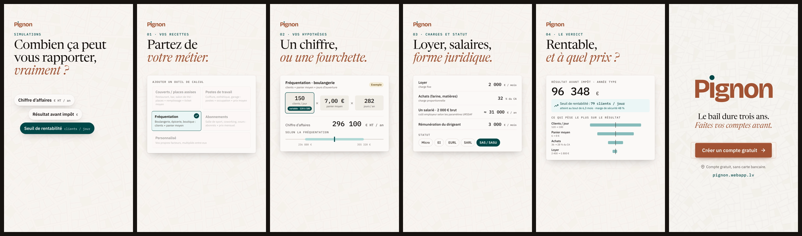

Le film montre les outils de recettes de l’app (couverts, postes, fréquentation, abonnements, personnalisé), valeur fixe ou fourchette, charges, salarié, dirigeant et statut, puis résultat, seuil de rentabilité et sensibilité (tornade). L’exemple de boulangerie est inventé mais cohérent : CA = clients × panier × 282 jours, achats 32 %, charges fixes 105 k€ ; les fourchettes, le seuil (79 clients/jour, marge de sécurité 48 %) et la tornade sont calculés à partir de ces hypothèses. Le coût employeur du salarié (≈ 31 k€) est une approximation, pas le calcul URSSAF de l’app.

## Pignon · Analyse du métier — 20 s, 9:16

**Vidéo : [`renders/pignon-metier-20s-9x16.mp4`](renders/pignon-metier-20s-9x16.mp4)** · couverture : [`renders/pignon-metier-couverture.png`](renders/pignon-metier-couverture.png)

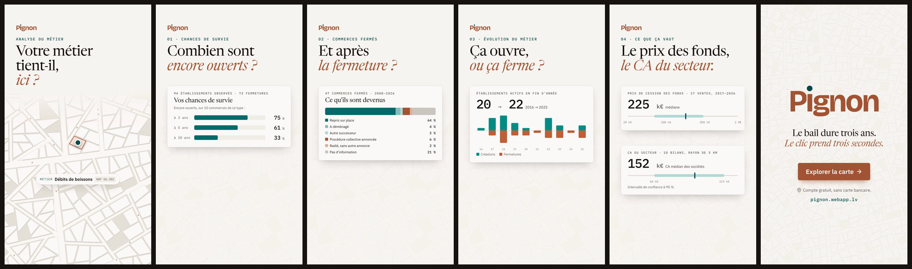

Le film montre les chiffres réels d’une session (débits de boissons), sans adresse : chances de survie (75 / 61 / 33 %), devenir des 47 commerces fermés depuis 2008, évolution 2016–2025 (20 → 22 établissements, créations et fermetures par an), prix de cession des fonds (médiane 225 k€, 17 ventes) et CA du secteur (médiane 152 k€, IC 95 % 60–219 k€).

## Pignon · Rapports et partage — 19 s, 9:16

**Vidéo : [`renders/pignon-rapports-19s-9x16.mp4`](renders/pignon-rapports-19s-9x16.mp4)** · couverture : [`renders/pignon-rapports-couverture.png`](renders/pignon-rapports-couverture.png)

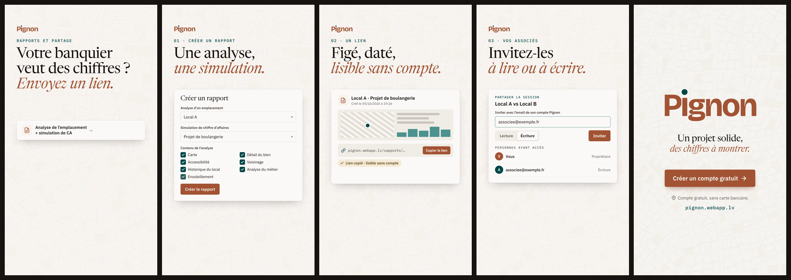

Le film montre le formulaire « Créer un rapport » (analyse d’un emplacement, simulation, contenu à cocher), lien du rapport (« fige les données à sa date de création », lisible sans compte), puis fenêtre « Partager la session » : invitation par email du compte Pignon, Lecture ou Écriture, personnes ayant accès. L’aperçu du rapport est stylisé ; l’adresse email est fictive.

## Pignon · Insights IA v2 — 25 s, 9:16

**Vidéo : [`renders/pignon-ia2-25s-9x16.mp4`](renders/pignon-ia2-25s-9x16.mp4)** · couverture : [`renders/pignon-ia2-couverture.png`](renders/pignon-ia2-couverture.png)

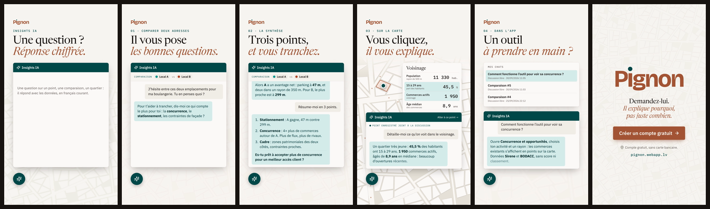

Le film reprend les trois conversations fournies, reformulées et sans adresse : une comparaison en plusieurs tours (l’IA demande ce qui compte, répond sur le stationnement — parking à 47 m contre 299 m —, résume en 3 points et renvoie la décision par une question), l’explication du panneau Voisinage après un clic sur la carte (11 330 hab., 45,5 % de 15–29 ans, 1 950 commerces, âge médian 8,9 ans) et l’aide sur l’outil Concurrence et opportunités, ouverte depuis « Mes chats ». Les « Local A / Local B » remplacent les adresses ; la phrase du CTA est inventée.

## Pignon · teaser — 13,6 s, 9:16

**Vidéo : [`renders/pignon-teaser-13.6s-9x16.mp4`](renders/pignon-teaser-13.6s-9x16.mp4)** · couverture : [`renders/pignon-teaser-couverture.png`](renders/pignon-teaser-couverture.png)

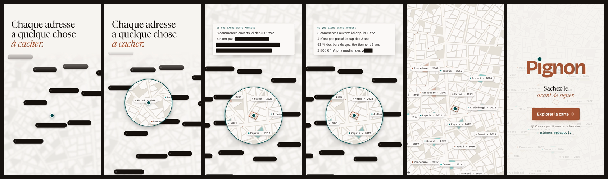

Sans interface. « Chaque adresse a quelque chose à cacher. » (site) : la ville est floue et des étiquettes caviardées sont posées sur les bâtiments. Le point devient une loupe qui suit le plus court chemin dans les rues ; sous elle, la ville est nette et les étiquettes se lisent (« Fermé · 2019 », « Repris · 2021 »…). Arrivé au local, son dossier se décaviarde ligne à ligne : 8 commerces depuis 1992, 4 n’ont pas passé 2 ans, 63 % des bars du quartier tiennent 5 ans, 3 800 €/m². La loupe s’ouvre ensuite sur toute la ville et le point devient celui du i.

Les chiffres du dossier viennent de l’exemple publié sur le site. Les étiquettes de la ville sont illustratives (catégories de l’app, années inventées). La phrase « Sachez-le avant de signer. » est une proposition.

## Pignon · teaser 2 — 14 s, 9:16

**Vidéo : [`renders/pignon-teaser2-14s-9x16.mp4`](renders/pignon-teaser2-14s-9x16.mp4)** · couverture : [`renders/pignon-teaser2-couverture.png`](renders/pignon-teaser2-couverture.png)

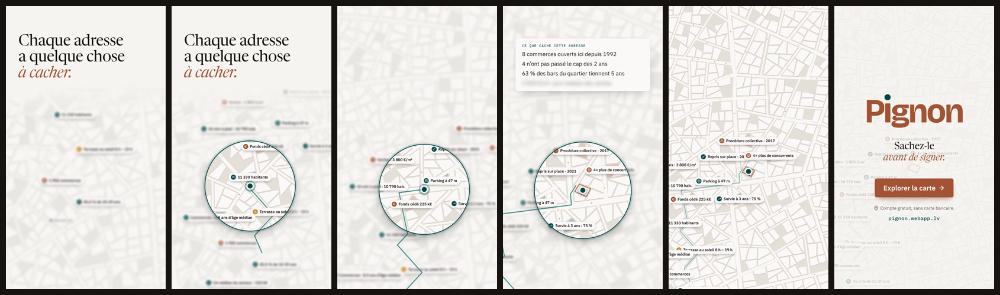

Variante du teaser : la ville et ses données sont floues, sans caviardage. Le point se balade dans les rues comme dans la première version (trace, deux arrêts), entouré d’une loupe qui rend net ce qu’elle survole. Les données sont variées : population, 15-29 ans, parking, commerces, soleil sur la terrasse, isochrone à 10 min, prix de cession, €/m², survie, CA du secteur, devenir des fermetures, concurrence, âge des commerces. Au local, le dossier se défloute ligne à ligne, puis la loupe s’ouvre sur toute la ville.

Les valeurs viennent de sessions réelles et de l’exemple du site ; leur placement sur la carte est illustratif, et les années du devenir sont inventées. La phrase « Sachez-le avant de signer. » est une proposition.

## Pignon · teaser 3, « Avant vous » — 16,2 s, 9:16

**Vidéo : [`renders/pignon-teaser3-16.2s-9x16.mp4`](renders/pignon-teaser3-16.2s-9x16.mp4)** · couverture : [`renders/pignon-teaser3-couverture.png`](renders/pignon-teaser3-couverture.png)

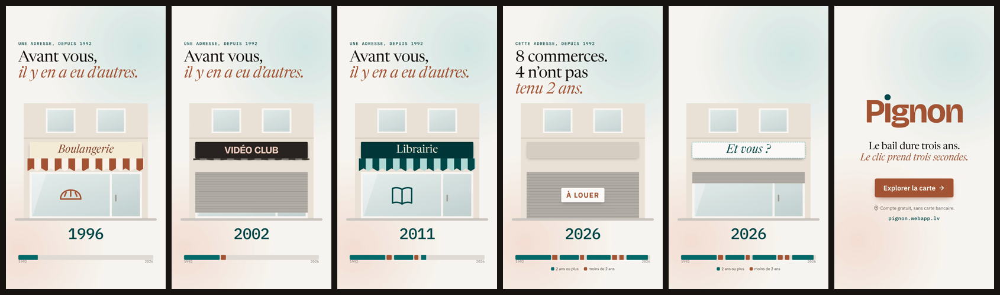

Une seule façade, de 1992 à 2026 en accéléré (1 an ≈ 0,26 s). Les occupants se succèdent : rideau qui se lève, enseigne, store, vitrine, puis rideau baissé et « À louer ». Pendant ce temps, l’année défile et une frise se remplit, en pétrole pour les commerces de 2 ans ou plus et en terracotta pour les autres. Arrêt sur image : « 8 commerces. 4 n’ont pas tenu 2 ans. » L’enseigne devient « Et vous ? », puis son point devient celui du i. La phrase finale (« Le bail dure trois ans. Le clic prend trois secondes. ») est reprise du site.

Le chiffre (8 ouvertures depuis 1992, dont 4 de moins de 2 ans) vient de l’exemple publié sur le site. Les métiers, les enseignes et les dates exactes sont inventés. Pour changer les occupants, modifiez `OCCUPANTS` dans `pignon-teaser3/teaser3.js`.

## Pignon · avant / après — 21 s, 9:16

**Vidéo : [`renders/pignon-avant-apres-21s-9x16.mp4`](renders/pignon-avant-apres-21s-9x16.mp4)** · couverture : [`renders/pignon-avant-apres-couverture.png`](renders/pignon-avant-apres-couverture.png)

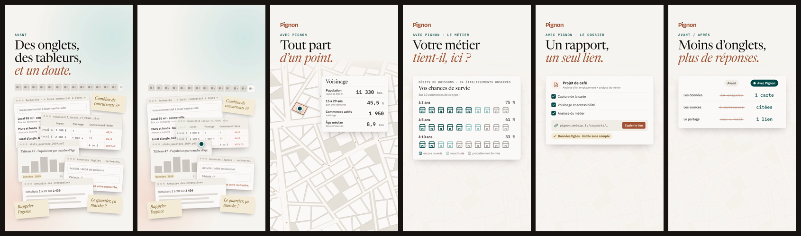

| Temps | Scène | Contenu |
|---|---|---|
| 0 – 4,7 s | Avant | « Des onglets, des tableurs, et un doute. » 14 onglets, une recherche d’annonces, un tableur plein de « ? » et de « #N/A », un PDF de 2019, des annonces légales sans résultat, un annuaire, des post-it. |
| 4,7 – 6 s | Bascule | Tout est aspiré dans un point, qui devient le point de la carte. |
| 6 – 8,7 s | Avec Pignon | « Tout part d’un point. » Panneau Voisinage du point. |
| 8,7 – 11,6 s | Le métier | « Votre métier tient-il, ici ? » Chances de survie en pictogrammes, comme dans l’app. |
| 11,6 – 14,4 s | Le dossier | « Un rapport, un seul lien. » |
| 14,4 – 17,5 s | Avant / après | « Moins d’onglets, plus de réponses. » 14 onglets → 1 carte ; sources à retrouver → citées ; partage par e-mail → 1 lien. |
| 17,5 – 21 s | Appel à l’action | Le point « Avec Pignon » devient le point du i. « Fermez les onglets. Ouvrez la carte. », « Explorer la carte → » |

La partie « Avant » est une mise en scène : sites et fichiers génériques, sans marque ni adresse. Les chiffres de la partie « Avec Pignon » viennent de sessions réelles (voisinage et survie des débits de boissons). Le tableau avant / après est une comparaison de principe, pas une mesure. Les phrases « Moins d’onglets, plus de réponses. » et « Fermez les onglets. Ouvrez la carte. » sont des propositions.

## Pignon · parcours d’un projet de café — 28,5 s, 9:16

**Vidéo : [`renders/pignon-parcours-28.5s-9x16.mp4`](renders/pignon-parcours-28.5s-9x16.mp4)** · couverture : [`renders/pignon-parcours-couverture.png`](renders/pignon-parcours-couverture.png)

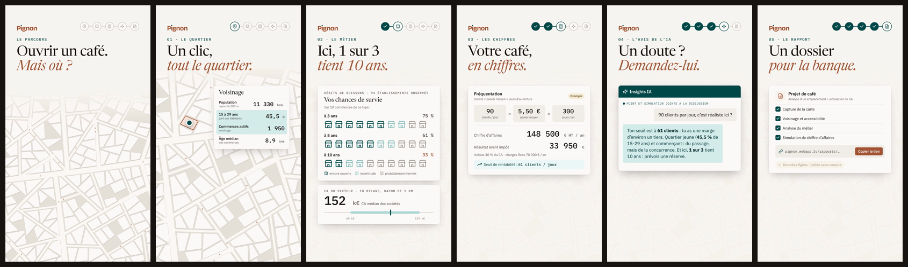

| Temps | Étape | Contenu |
|---|---|---|
| 0 – 2,4 s | Accroche | « Ouvrir un café. Mais où ? » et le rail des 5 étapes. |
| 2,4 – 6,7 s | 01 · Le quartier | Un clic, le panneau Voisinage ; les lignes 15-29 ans et commerces actifs s’allument. |
| 6,7 – 11,4 s | 02 · Le métier | « Ici, 1 sur 3 tient 10 ans. » Survie en pictogrammes (75 / 61 / 33 %) et CA médian du secteur (152 k€, IC 95 % 60–219 k€). |
| 11,4 – 16 s | 03 · Les chiffres | 90 clients × 5,50 € × 300 jours = 148 500 € HT ; résultat 33 950 € ; seuil de rentabilité 61 clients / jour. |
| 16 – 21 s | 04 · L’avis de l’IA | « 90 clients par jour, c’est réaliste ici ? » La réponse relie seuil, quartier et survie. |
| 21 – 24,5 s | 05 · Le rapport | « Un dossier pour la banque. » Les 4 sections, le lien, « lisible sans compte ». |
| 24,5 – 28,5 s | Appel à l’action | La dernière étape du rail devient le point du i. « De la carte à la décision. » (texte du site), « Créer un compte gratuit → » |

Voisinage, survie et CA du secteur : chiffres de sessions réelles, sans adresse. La simulation est un exemple calculé et cohérent : achats 30 % du CA, charges fixes 70 000 €/an, donc seuil = 70 000 / (5,50 × 300 × 0,7) ≈ 61 clients/jour et marge de sécurité d’un tiers. Son CA (148,5 k€) est proche de la médiane réelle du secteur. La réponse de l’IA est écrite pour la vidéo, dans le style des sessions fournies ; la banque est un élément de récit.

## Pignon · série « Le chiffre » — 3 × 11,5 s, 9:16

| Épisode | Vidéo | Le chiffre | Image |
|---|---|---|---|
| n°1 | [`renders/pignon-chiffre-ep1-11.5s-9x16.mp4`](renders/pignon-chiffre-ep1-11.5s-9x16.mp4) | 33 % encore ouverts au bout de 10 ans | 10 pictogrammes de l’app, de l’ouverture à 3, 5 et 10 ans |
| n°2 | [`renders/pignon-chiffre-ep2-11.5s-9x16.mp4`](renders/pignon-chiffre-ep2-11.5s-9x16.mp4) | 64 % des fermetures ont trouvé un repreneur sur place | 47 points, un par commerce fermé, colorés par devenir |
| n°3 | [`renders/pignon-chiffre-ep3-11.5s-9x16.mp4`](renders/pignon-chiffre-ep3-11.5s-9x16.mp4) | 225 k€, prix médian d’un fonds | Échelle log : une vente sur deux entre 60 et 470 k€, ventes isolées, ventes par an |

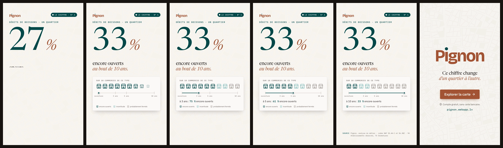
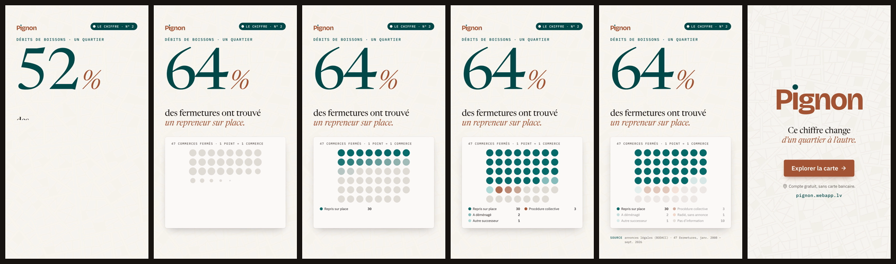
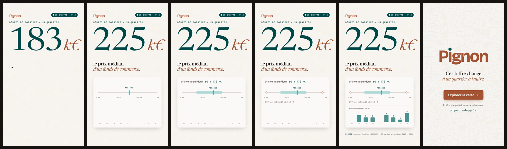

Un seul gabarit (`pignon-chiffre/`), l’épisode est choisi par `?ep=1|2|3` (rendu : `--param ep=2`). Pour un nouvel épisode, ajoutez une entrée à `EPISODES` dans `chiffre.js` et son visuel dans `index.html`. Tous les chiffres viennent d’une même session de l’app (débits de boissons, un quartier, sans adresse) et les sources sont celles qu’affiche l’app :

- **n°1** : codes NAF 55.4A-C et 56.30Z, 94 établissements observés, 73 fermetures. Les pictogrammes reprennent ceux de l’app (6/2/2, 5/2/3, 2/2/6 sur 10).
- **n°2** : 47 fermetures entre janvier 2008 et septembre 2026, d’après les annonces légales (BODACC). Les nombres de points sont les pourcentages de l’app appliqués à 47 : 30 repris, 2 déménagés, 1 autre successeur, 3 procédures, 1 radié, 10 sans information.
- **n°3** : 17 ventes annoncées entre 2017 et 2026 (BODACC). Médiane 225 k€, une vente sur deux entre 60 et 470 k€, extrêmes 21 k€ et 1,6 M€. Ventes par an de 2017 à 2025 ; 2026 est partiel, sans vente.

La phrase de fin, « Ce chiffre change d’un quartier à l’autre. », est une proposition.

## Pignon · rapport + simulation — 25 s, 9:16

**Vidéo : [`renders/pignon-rapport-simu-25s-9x16.mp4`](renders/pignon-rapport-simu-25s-9x16.mp4)** · couverture : [`renders/pignon-rapport-simu-couverture.png`](renders/pignon-rapport-simu-couverture.png)

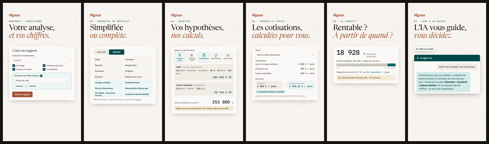

| Temps | Scène | Contenu |
|---|---|---|
| 0 – 3,2 s | Accroche | « Votre analyse, et vos chiffres. » Formulaire « Créer un rapport » : l’analyse d’un emplacement (dont l’analyse du métier), puis la simulation de chiffre d’affaires, en Essentiel ou Détaillé. |
| 3,2 – 7 s | 01 · Essentiel ou Détaillé | « Simplifiée ou complète. » La pastille glisse, les réglages détaillés apparaissent (charges variables, investissements, plan de financement, saisonnalité, graphiques, compte de résultat). « Mêmes données : le mode montre ou cache des réglages. » |
| 7 – 10,9 s | 02 · Recettes | « Vos hypothèses, nos calculs. » Les 5 outils, la formule de chaque outil avec ses valeurs (203 040 + 50 760 = 253 800 € HT). « Pignon ne devine jamais votre CA. » |
| 10,9 – 14,7 s | 03 · Charges et statut | Statut SAS, charges fixes, salaire brut 2 000 € → coût employeur 2 248,52 €/mois (paramètres URSSAF), barème de l’IS. |
| 14,7 – 18,5 s | 04 · Le verdict | Résultat net 18 928 €, seuil de rentabilité 221 053 € (mois 10,5), marge de sécurité 12,9 % soit 31 couverts/jour, « Votre résultat s’annule avec −13 % de CA ». |
| 18,5 – 22 s | 05 · Aide à la saisie | L’assistant pose les questions et dit où saisir, sans proposer de chiffre. |
| 22 – 25 s | Appel à l’action | « Votre analyse. Vos chiffres. Un rapport. », « Créer un compte gratuit → » |

Libellés repris de la page Simulations (export fourni) et de la spécification du simulateur. Recettes, charges fixes, résultat, seuil, marge et fragilité : exemple de contrôle de la spécification (restaurant en SAS, salle + vente à emporter, prix TTC convertis en HT). Le coût employeur (2 000 € brut → 2 248,52 €/mois) est un appel URSSAF documenté, montré pour le mécanisme : il n’est pas celui de l’exemple de contrôle, dont les salaires sont saisis en coût. La réponse de l’assistant est écrite pour la vidéo, selon ses règles (guide sans action, libellés exacts, aucune valeur proposée). La phrase du CTA est une proposition.

## Utilisation

```bash
npm install                 # Chromium : npx playwright install chromium (hors de cet environnement)
npm run preview             # http://127.0.0.1:4173/pignon/, /pignon-ombres/, /pignon-ia/, /pignon-tuto/, /pignon-v2/, /pignon-simulation/, /pignon-metier/, /pignon-rapports/, /pignon-ia2/, /pignon-teaser/, /pignon-teaser2/, /pignon-teaser3/, /pignon-rapport-simu/, /pignon-avant-apres/, /pignon-parcours/ ou /pignon-chiffre/?ep=2 : espace = pause, flèches = image par image, ?t=7.5 pour figer
npm run render              # renders/pignon-15s-9x16.mp4 (60 i/s)
npm run render:ombres       # renders/pignon-ombres-15s-9x16.mp4
npm run render:ia           # renders/pignon-ia-15s-9x16.mp4
npm run render:tuto         # renders/pignon-tuto-20s-9x16.mp4
npm run render:v2           # renders/pignon-v2-29s-9x16.mp4
npm run render:simulation   # renders/pignon-simulation-21.5s-9x16.mp4
npm run render:metier       # renders/pignon-metier-20s-9x16.mp4
npm run render:rapports     # renders/pignon-rapports-19s-9x16.mp4
npm run render:ia2          # renders/pignon-ia2-25s-9x16.mp4
npm run render:teaser       # renders/pignon-teaser-13.6s-9x16.mp4
npm run render:teaser2      # renders/pignon-teaser2-14s-9x16.mp4
npm run render:teaser3      # renders/pignon-teaser3-16.2s-9x16.mp4
npm run render:rapport-simu # renders/pignon-rapport-simu-25s-9x16.mp4
npm run render:avant-apres  # renders/pignon-avant-apres-21s-9x16.mp4
npm run render:parcours     # renders/pignon-parcours-28.5s-9x16.mp4
npm run render:chiffre      # renders/pignon-chiffre-ep1|ep2|ep3-11.5s-9x16.mp4 (--param ep=N)
npm run stills              # images clés et planche dans renders/stills/
```

Le rendu parcourt la timeline GSAP (en pause) avec `window.__seek(t)` et capture chaque image. Le résultat est identique d’une machine à l’autre. Pour changer un texte, modifiez `pignon/index.html`. Pour changer un timing, modifiez `pignon/main.js` : chaque scène y est un bloc repéré par un commentaire.
