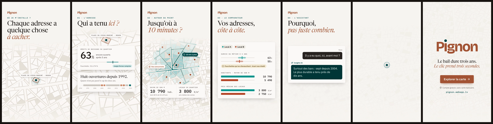
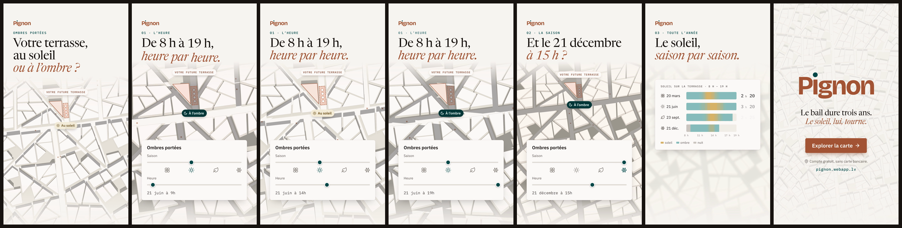

# motion-design

Motion designs codés en HTML/CSS/GSAP, rendus image par image en MP4 (Playwright + ffmpeg).

## Pignon — 15 s, 9:16

**Vidéo : [`renders/pignon-15s-9x16.mp4`](renders/pignon-15s-9x16.mp4)** — 1080 × 1920, 60 i/s, H.264 (BT.709), sans piste son.
Couverture : [`renders/pignon-couverture.png`](renders/pignon-couverture.png).



| Temps | Scène | Contenu |
|---|---|---|
| 0 – 2,1 s | Accroche | « Chaque adresse a quelque chose à cacher. » Un clic sur la carte fait apparaître le point sur le local. |
| 2,1 – 4,6 s | 01 · L’adresse | « Qui a tenu ici ? » Survie du métier : 63 % (fourchette 51 à 74 %) et historique du local : huit ouvertures depuis 1992. |
| 4,6 – 7,1 s | 02 · Autour du point | « Jusqu’où à 10 minutes ? » Isochrone à pied calculée sur le réseau de rues, concurrents, 10 790 hab. et 3 800 €/m². |
| 7,1 – 9,4 s | 03 · Le comparateur | « Vos adresses, côte à côte. » Fourchettes qui se chevauchent, donc écart non établi. |
| 9,4 – 11,7 s | 04 · L’assistant | « Pourquoi, pas juste combien. » Une question et la réponse d’Insights IA. |
| 11,7 – 15 s | Appel à l’action | Le point de la carte devient le point du i du logo. « Le bail dure trois ans. Le clic prend trois secondes. », bouton « Explorer la carte → », « Compte gratuit, sans carte bancaire. », pignon.webapp.lv |

### Charte reprise

Source : webarchive de la page Carte de pignon.webapp.lv, plus des captures du site.

- **Couleurs** : les tokens de `pignon-tokens.css`. Terracotta 600 `#a55535` (actions, logo), pétrole 600 `#00494a` (données, point du i), neutres chauds `#f9f6f2` / `#fefbf9`, couleurs du comparateur `#00958f` / `#b54628`.
- **Typographies** : Newsreader (titres), IBM Plex Sans (interface), IBM Plex Mono (chiffres, surtitres), Bricolage Grotesque 700 (logo). Toutes sous licence OFL et incluses dans `pignon/fonts/`.
- **Logo** : reconstruit comme `.pgn-logo` du site (P, i dessiné, gnon).
- **Mouvement** : les courbes `--pgn-easing-standard` et `--pgn-easing-ressort`.
- **Carte** : l’algorithme du fond « rue » du site (`pignon-rue-bg.js`), étiré en portrait et rendu déterministe.
- **Textes** : repris du site (accroche, rubriques, CTA, réponse de l’assistant).

### Données

Les chiffres viennent de l’exemple publié sur le site (Place du Vieux-Marché, Rouen). Trois éléments sont illustratifs : la position des huit ouvertures sur la frise (cohérente avec les textes du site), les valeurs du « Local B » dans le comparateur, et la carte, qui est procédurale et ne représente pas Rouen.

## Pignon · ombres portées — 15 s, 9:16

**Vidéo : [`renders/pignon-ombres-15s-9x16.mp4`](renders/pignon-ombres-15s-9x16.mp4)** — 1080 × 1920, 60 i/s, sans son.
Couverture : [`renders/pignon-ombres-couverture.png`](renders/pignon-ombres-couverture.png).



| Temps | Scène | Contenu |
|---|---|---|
| 0 – 2,1 s | Accroche | « Votre terrasse, au soleil ou à l’ombre ? » La terrasse se dessine devant le local. |
| 2,1 – 6,4 s | 01 · L’heure | Le panneau « Ombres portées » de la carte. Le curseur Heure avance par pas d’une heure, de 8 h à 19 h le 21 juin ; les ombres tournent et la pastille passe de « À l’ombre » à « Au soleil ». |
| 6,4 – 9,6 s | 02 · La saison | « Et le 21 décembre à 15 h ? » Le curseur Saison glisse du 21 juin au 21 décembre ; les ombres s’allongent. |
| 9,6 – 11,7 s | 03 · Toute l’année | Bilan : soleil sur la terrasse de 8 h à 19 h, aux deux équinoxes et aux deux solstices. |
| 11,7 – 15 s | Appel à l’action | Le point de la terrasse devient le point du i. « Le bail dure trois ans. Le soleil, lui, tourne. », « Explorer la carte → » |

Les ombres ne sont pas animées à la main : chaque image calcule la position du soleil à Rouen pour la date et l’heure affichées (`pignon-ombres/soleil.js`, formules NOAA, heure d’été 2026), puis projette chaque bâtiment au sol selon sa hauteur. L’état de la pastille et le bilan viennent du même calcul. Les bâtiments, leurs hauteurs (9 à 24 m) et la terrasse sont fictifs : la terrasse est choisie automatiquement pour que soleil et ombre s’y relaient. Le panneau reprend `.pgn-panneau-ombres` (curseur Saison de 0 à 364, curseur Heure de 8 h à 19 h, repères et icônes du site). La phrase « Le soleil, lui, tourne. » est une proposition, elle n’est pas reprise du site.

## Utilisation

```bash
npm install                 # Chromium : npx playwright install chromium (hors de cet environnement)
npm run preview             # http://127.0.0.1:4173/pignon/ ou /pignon-ombres/ : espace = pause, flèches = image par image, ?t=7.5 pour figer
npm run render              # renders/pignon-15s-9x16.mp4 (60 i/s)
npm run render:ombres       # renders/pignon-ombres-15s-9x16.mp4
npm run render:30           # variante 30 i/s
npm run stills              # images clés et planche dans renders/stills/
```

Le rendu parcourt la timeline GSAP (en pause) avec `window.__seek(t)` et capture chaque image. Le résultat est identique d’une machine à l’autre. Pour changer un texte, modifiez `pignon/index.html`. Pour changer un timing, modifiez `pignon/main.js` : chaque scène y est un bloc repéré par un commentaire.
